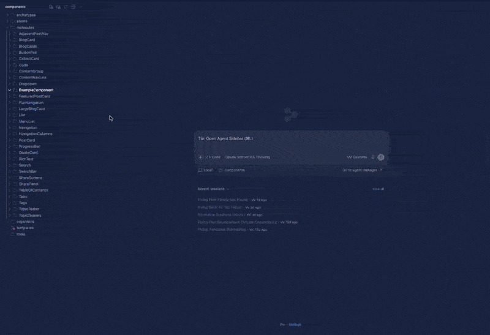
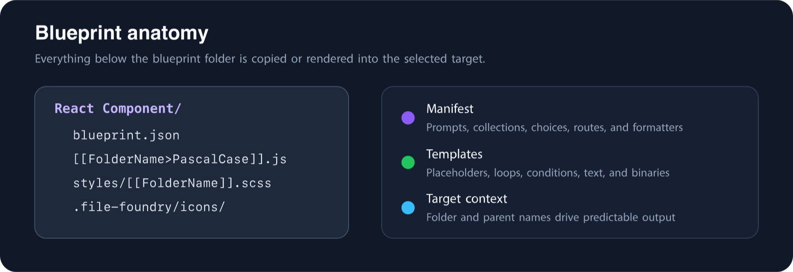
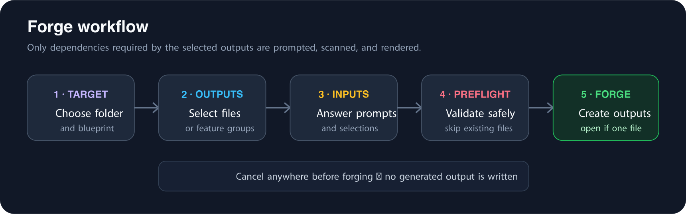
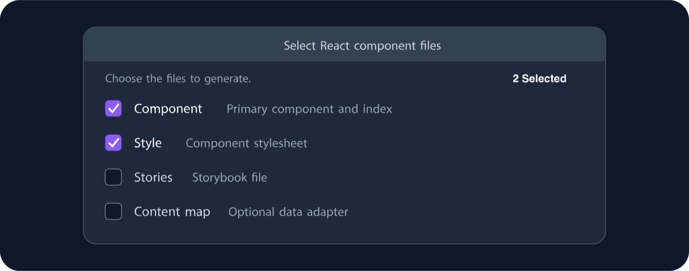

# File Foundry

File Foundry is a VS Code extension for turning reusable directory blueprints into real project files. A blueprint can contain nested folders, empty folders, dotfiles, text files, and binary files. File Foundry replaces context-aware placeholders in folder names, file names, and UTF-8 text content while copying binary content unchanged.

The extension validates the entire output before it writes anything. Unknown placeholders, unsafe paths, symlinks, duplicate destinations, and unreadable sources stop the forge operation before generation begins.

<p align="center">
  
</p>

<p align="center">
  
</p>

## Start here

New to File Foundry? Follow this shortest path:

1. [Configure one blueprint directory](#configure-the-blueprint-directory).
2. Create an immediate child folder for a blueprint and add one templated file.
3. Use [built-in placeholders](#built-in-placeholders) such as `[[FolderName>PascalCase]]` in its name or contents.
4. [Forge the blueprint](#forge-a-blueprint) into a project folder.
5. Add a [`blueprint.json`](#blueprint-manifests) when you need prompts, collections, selectable files, routing, or formatting.

The directory-only format is intentionally useful: a blueprint does not need a manifest until it needs interactive behavior.

## Table of contents

- [Start here](#start-here)
- [Set up and forge](#set-up-and-forge)
  - [Configure the blueprint directory](#configure-the-blueprint-directory)
  - [Blueprint discovery](#blueprint-discovery)
  - [Most Selected blueprints](#most-selected-blueprints)
  - [Forge a blueprint](#forge-a-blueprint)
  - [Existing files and safety](#existing-files)
- [Author a blueprint](#author-a-blueprint)
  - [Blueprint manifests](#blueprint-manifests)
  - [Built-in placeholders](#built-in-placeholders)
  - [Transformations](#transformations)
  - [Names, paths, and text](#names-and-nested-paths)
  - [Custom placeholders](#custom-placeholders)
  - [Interactive prompts](#interactive-prompts)
  - [Collections](#collections)
  - [Collection selections](#selecting-collection-records)
  - [Template loops](#template-loops)
  - [Conditional templates](#conditional-templates)
  - [Selectable output](#selectable-output)
  - [Formatters, workspace edits, and output routes](#output-formatters-and-workspace-edits)
  - [Complete manifest example](#complete-manifest-example)
- [Extract structured data](#extract-collections)
  - [`fileFoundry.regex`](#filefoundryregex)
  - [`fileFoundry.wordpressProps`](#filefoundrywordpressprops)
  - [`fileFoundry.javascriptProps`](#filefoundryjavascriptprops)
  - [Extractor presets](#extractor-presets)
  - [Custom JavaScript extractors](#custom-javascript-extractors)
- [Reference](#feature-reference)
  - [Feature index](#feature-index)
  - [Commands](#commands)
  - [Settings](#settings)
  - [Performance and resource use](#performance-and-resource-use)
  - [Troubleshooting](#troubleshooting)
  - [Development](#development)

## Feature reference

### Feature index

Use this index when you know the outcome you want but not the File Foundry term for it.

| I want to… | Feature | Start with |
| --- | --- | --- |
| Rename files from the target folder | Built-in placeholders and transforms | `[[FolderName>PascalCase]]` |
| Reuse a derived name everywhere | Custom placeholder | `[[Custom:ComponentName]]` |
| Ask for text, one choice, many choices, yes/no, a file, or a folder | Interactive prompts | `prompts` |
| Discover workspace files or folders | Filesystem collection | `collections.*.type: "filesystem"` |
| Read props, regex matches, or custom structured data | Extract collection | `collections.*.type: "extract"` |
| Let the user choose discovered records | Collection selection | `type: "selectFromCollection"` |
| Repeat output for records | Template loop | `[[#each … as …]]` |
| Render one of several variants | Conditional template | `[[#if …]]` / `[[#elseif]]` / `[[#else]]` |
| Check whether names contain a fragment | `contains` condition | `Prompt:Props.name contains "Image"` |
| Let users choose groups of generated files | Selectable output | `fileSelection` |
| Exclude empty variant-only files | Empty-output omission | `omitEmptyFiles: true` |
| Align generated PHP operators | Output formatter | `alignAssignments` or `alignPhpOperators` |
| Register a generated WordPress package | Guarded workspace edit | `usefulGroupPhpRegistry` |
| Route WordPress block output elsewhere | Output route | `wordpressTemplateBlock` |
| Add safe reusable extraction rules | Extractor preset | `fileFoundry.extractorsFile` |
| Run a project-specific parser | Trusted custom extractor | `fileFoundry.customExtractorsDirectory` |
| Include defaults even when a collection source is absent | Initial records | `initialRecords` plus `onMissing: "empty"` |
| Keep frequent blueprints at the top | Most Selected | `fileFoundry.mostSelectedBlueprints` |

## Set up and forge

The forge workflow is dependency-aware: output selection happens before prompts, only active dependencies are resolved, and the complete write plan is validated before filesystem changes begin.

<p align="center">
  
</p>

## Configure the blueprint directory

Run **File Foundry: Configure Blueprint Directory** from the Command Palette. Choose a local directory, then save it to either Workspace Settings or User Settings.

You can also edit **File Foundry › Blueprints Directory** in the Settings UI. The setting ID is:

```json
"fileFoundry.blueprintsDirectory": "/absolute/path/to/blueprints"
```

The path may be:

- Absolute, such as `/Users/me/blueprints` or `C:\Users\me\blueprints`
- Home-relative, such as `~/blueprints`
- Workspace-relative, such as `.file-foundry/blueprints`

A relative path is resolved against the workspace folder containing the selected target. If there is no matching folder, File Foundry uses the first workspace folder. Relative paths require an open workspace.

Run **File Foundry: Open Blueprint Directory** to reveal the resolved directory in your operating system.

## Blueprint discovery

Every immediate child directory of the configured directory is one blueprint. Its directory name is the default Quick Pick label; a manifest may override it.

```text
blueprints/
├── React Component/
│   ├── blueprint.json
│   ├── [[FolderName>PascalCase]].js
│   ├── [[FolderName>PascalCase]].scss
│   └── index.js
├── Content Model/
│   └── schema.json
└── WordPress Block/
    └── block.json
```

When selected, the contents of the blueprint directory are copied directly into the target. File Foundry does not create an extra directory named after the blueprint. `.DS_Store`, `Thumbs.db`, and `blueprint.json` are never generated; intentional dotfiles are included. Symlinks are unsupported and fail preflight validation.

A working demonstration is included in the repository at `examples/blueprints`.

## Most Selected blueprints

Most Selected is enabled by default. File Foundry records a tiny workspace-local usage count when a valid blueprint is chosen and moves up to three frequent choices into a starred **Most Selected** section above the alphabetical list. A blueprint appears only once in the picker.

Membership is count-first. When candidates have the same count, the three most recently selected candidates remain in the section, displayed oldest-to-newest within that tie. This gives the list predictable queue behavior:

1. If Alpha, Beta, and Charlie each have two selections, they fill the section.
2. Selecting Delta for the second time evicts Alpha, the oldest tied member, and adds Delta at the bottom: Beta, Charlie, Delta.
3. Selecting Alpha again raises it to three selections. Alpha moves to the top and the next-oldest two-selection member is evicted.

The history uses VS Code workspace state rather than project files or settings synchronization. It is capped at 100 compact records, keeps only three displayed entries, performs one storage update per blueprint selection, and has no timers, watchers, polling, or background work.

Set `fileFoundry.mostSelectedBlueprints` to `false` in User Settings to disable it globally. Because the setting is resource-scoped, a workspace setting can override the global choice in either direction. Run **File Foundry: Clear Most Selected Blueprints** from the Command Palette (`Shift+Cmd+P` on macOS) to erase the current workspace's history.

## Author a blueprint

A blueprint is ordinary files plus File Foundry's `[[…]]` template syntax. Add capabilities incrementally:

1. Begin with a folder of static or placeholder-driven files.
2. Add a manifest for display metadata and prompts.
3. Add collections when output depends on existing project data.
4. Add loops and conditions to render structured variants.
5. Add file selection, formatters, workspace edits, or routes only where the workflow needs them.

The examples below are independent and copyable. The [complete manifest](#complete-manifest-example) shows how the pieces compose.

## Blueprint manifests

A blueprint may contain an optional `blueprint.json`. Manifests use strict JSON—comments and executable expressions are not allowed—and currently support only `"version": 1`.

```json
{
  "version": 1,
  "name": "Atomic React Component",
  "description": "Creates a component with selectable supporting files.",
  "omitEmptyFiles": false,
  "placeholders": {},
  "collections": {},
  "prompts": [],
  "fileSelection": {},
  "formatters": [],
  "workspaceEdits": [],
  "outputRoutes": []
}
```

| Property | Required | Purpose |
| --- | --- | --- |
| `version` | Yes | Manifest schema version; currently `1`. |
| `name` | No | Blueprint-picker title; defaults to the blueprint directory name. |
| `description` | No | Concise supporting text in the blueprint picker. |
| `omitEmptyFiles` | No | Omits UTF-8 files that render to zero bytes; defaults to `false`. |
| `placeholders` | No | Named derived values composed from context and prompt placeholders. |
| `collections` | No | Filesystem discoveries or records extracted from a text source. |
| `prompts` | No | Ordered interactive inputs and collection selections. |
| `fileSelection` | No | User-selectable source-file groups. |
| `formatters` | No | Post-render formatting for named blueprint sources. |
| `workspaceEdits` | No | Guarded edits to supported existing workspace registries. |
| `outputRoutes` | No | Supported destination decisions for selected source files. |

Set `omitEmptyFiles` to `true` when whole-file conditionals intentionally render some variant-only files as empty. Unknown top-level properties produce an output-channel warning so future metadata does not prevent generation.

An invalid manifest is shown using its directory name without disrupting other blueprints. Selecting it reports the manifest error. A blueprint without a manifest retains the original behavior: its directory name is shown, no custom prompts appear, and all source contents are generated.

## Custom placeholders

Manifest-defined custom values use identifier keys beginning with a letter and containing letters, numbers, or underscores:

```json
{
  "version": 1,
  "placeholders": {
    "ComponentName": {
      "value": "[[FolderName>PascalCase]]"
    },
    "ClassBase": {
      "value": "[[DirLetter>LowerCase]]-[[FolderName>KebabCase]]"
    },
    "DisplayName": {
      "value": "[[Prompt:ComponentLabel>TitleCase]]"
    }
  }
}
```

Use them in directory names, file names, and text content:

```text
[[Custom:ComponentName]]
[[Custom:DisplayName>SnakeCase]]
```

Custom values may reference built-in placeholders, prompt placeholders, or other custom placeholders. File Foundry resolves them through an explicit dependency graph, then applies any transform at the usage location. Circular dependencies are rejected with their chain, such as `First → Second → First`. Undefined custom or prompt references are also rejected.

## Interactive prompts

Prompt definitions live in the ordered `prompts` array and are referenced with `[[Prompt:Key]]` or `[[Prompt:Key>Transform]]`. A key is prompted at most once; each transformed usage operates independently on the original answer.

Only prompts needed by selected output names, selected text content, or required custom-placeholder dependencies are shown. Prompts referenced only by unselected files are skipped. Pressing Escape during output selection or any prompt cancels the entire forge without writing files or displaying an alarming error.

| Type | Native interface | Result |
| --- | --- | --- |
| `input` | Input box | Entered text |
| `pick` | Single-selection Quick Pick | Selected option's `value` |
| `multiPick` | Multi-selection Quick Pick | Selected values joined by `separator` |
| `confirm` | Yes/no Quick Pick | Configured true or false string value |
| `file` | File open dialog | Selected file path in the requested format |
| `folder` | Folder open dialog | Selected directory path in the requested format |
| `selectFromCollection` | Single- or multi-selection Quick Pick | One structured record or an ordered record array |

Every prompt uses `key`, `type`, and `title`. `prompt` is optional supporting text. Type-specific properties are summarized here and demonstrated in the sections below.

| Type | Additional properties |
| --- | --- |
| `input` | `placeholder`, `default`, `required`, `password`, `validation`, `autoValue` |
| `pick` | `options`, `default` |
| `multiPick` | `options`, `default`, `separator`, `required` |
| `confirm` | `default`, `trueLabel`, `falseLabel`, `trueValue`, `falseValue` |
| `file` | `pathFormat`, `filters` |
| `folder` | `pathFormat` |
| `selectFromCollection` | `collection`, `selection`, `option` |

Picker options support `label`, `value`, `description`, `detail`, and `iconPath`. Collection-selection display templates support `label`, `description`, and `detail` through `[[Item:field]]` syntax.

### Input prompts

```json
{
  "key": "DisplayName",
  "type": "input",
  "title": "Display name",
  "prompt": "Enter the human-readable component name.",
  "placeholder": "Reading Time",
  "default": "[[FolderName>TitleCase]]",
  "required": true,
  "password": false,
  "validation": {
    "pattern": "^[A-Za-z][A-Za-z0-9 ._-]*$",
    "message": "Begin with a letter and use a simple display name."
  }
}
```

Input defaults may contain built-in context placeholders, but not prompt or custom placeholders. `required` rejects blank input. `validation.pattern` is a JavaScript regular-expression pattern; invalid patterns invalidate the manifest before prompting. `validation.message` customizes the inline error.

WordPress package blueprints may resolve a namespace from a workspace `useful-group/functions.php` before showing the input box:

```json
{
  "key": "ProjectNamespace",
  "type": "input",
  "title": "Project PHP namespace",
  "autoValue": { "type": "usefulGroupPhpNamespace" }
}
```

File Foundry prefers the `useful-group` containing the forge target. If the workspace contains one unambiguous `useful-group` elsewhere, it uses that folder. When no matching root `functions.php` or PHP `namespace` declaration is available, the input prompt appears normally.

### Pick and multi-pick prompts

Pick options require distinct `value` strings. Labels, descriptions, details, and optional manifest-relative `iconPath` values affect the interface; only the value enters generated output. `iconPath` may be one relative path or `{ "light": "...", "dark": "..." }` for theme-aware icons. Keep non-output picker assets beneath `.file-foundry/`; that metadata directory is never forged.

```json
{
  "key": "Language",
  "type": "pick",
  "title": "Language",
  "options": [
    { "label": "JavaScript", "value": "js", "description": "Generate JavaScript" },
    { "label": "TypeScript", "value": "ts", "description": "Generate TypeScript" }
  ],
  "default": "js"
}
```

A `multiPick` default is an array of declared values. Its selected values are joined using `separator`, which defaults to `, `. Set `required` to require at least one selection.

```json
{
  "key": "Keywords",
  "type": "multiPick",
  "title": "Keywords",
  "options": [
    { "label": "Accessible", "value": "accessible" },
    { "label": "Responsive", "value": "responsive" }
  ],
  "default": ["accessible"],
  "separator": ", ",
  "required": false
}
```

### Confirm prompts

Confirm prompts default to labels `Yes` and `No` and replacement strings `true` and `false`. `default` may be `true` or `false`. Customize them with `trueLabel`, `falseLabel`, `trueValue`, and `falseValue`.

```json
{
  "key": "IncludeStyles",
  "type": "confirm",
  "title": "Include styles?",
  "default": true,
  "trueLabel": "Yes, include styles",
  "falseLabel": "No stylesheet",
  "trueValue": "enabled",
  "falseValue": "disabled"
}
```

### File and folder prompts

File and folder prompts use the native open dialog and support these `pathFormat` values:

- `absolute`: complete absolute path; this is the default.
- `workspaceRelative`: path relative to the containing workspace folder. Selection outside every workspace is rejected.
- `targetRelative`: path relative to the forge target.
- `basename`: only the selected file or directory name.

File prompts can provide VS Code filters:

```json
{
  "key": "SourceFile",
  "type": "file",
  "title": "Choose a source file",
  "filters": { "JavaScript": ["js", "jsx"] },
  "pathFormat": "workspaceRelative"
}
```

A folder prompt uses the same shape with `"type": "folder"` and no filters.

## Collections

Collections are named arrays of structured records. A collection can discover files and folders or extract data from one text file. Templates can render every record directly, or a `selectFromCollection` prompt can let the user choose records first.

```text
filesystem or extractor → collection → optional selection prompt → placeholders and loops
```

Collection names start with a letter and contain only letters, numbers, and underscores. Collections are resolved only when a selected output references them, and each named collection is scanned once per forge operation. An unused collection—even one referenced by an unselected optional file—is not resolved.

| Property | Applies to | Purpose |
| --- | --- | --- |
| `type` | All | `filesystem` (default) or `extract`. |
| `source` | All | Safe `scope` plus relative templated `path`. |
| `sort` | All | Stable sort field, direction, case sensitivity, and numeric behavior. |
| `onEmpty` | All | `continue`, `warn`, or `error` after records are combined. |
| `onMissing` | All | `error` (default) or `empty` when the source is unavailable. |
| `initialRecords` | All | Flat scalar records placed before discovered records. |
| `uniqueBy` | All | Final-list deduplication field; first record wins. |
| `kind` | Filesystem | `file`, `folder`, or `any`. |
| `recursive`, `maxDepth` | Filesystem | Directory traversal behavior. |
| `includeHidden`, `followSymlinks` | Filesystem | Hidden-entry and trusted symlink behavior. |
| `include`, `exclude` | Filesystem | Safe minimatch filters. |
| `extract` | Extract | Registered extractor `type` and its `options`. |

### Filesystem collections

```json
{
  "collections": {
    "ComponentFiles": {
      "type": "filesystem",
      "source": { "scope": "target", "path": "." },
      "kind": "file",
      "recursive": true,
      "maxDepth": 3,
      "includeHidden": false,
      "followSymlinks": false,
      "include": ["**/*.js", "**/*.jsx"],
      "exclude": ["**/*.test.js", "**/*.stories.js", "**/node_modules/**"],
      "sort": {
        "by": "relativePath",
        "direction": "ascending",
        "caseSensitive": false,
        "numeric": true
      },
      "onEmpty": "continue"
    }
  }
}
```

`type` defaults to `filesystem`. `kind` accepts `file`, `folder`, or `any` and defaults to `any`. Scanning is non-recursive by default. With `recursive: true`, `maxDepth` limits descent; omitting it allows all depths inside the source root.

Hidden entries are excluded when `includeHidden` is false, and hidden directories are not traversed. When true, dotfiles participate normally. A root `blueprint.json` is always excluded when scanning a blueprint source.

`include` and `exclude` are minimatch globs evaluated against forward-slash collection-relative paths. An omitted or empty `include` accepts every record of the requested kind. Exclusions run second and always win. Absolute and escaping patterns are rejected.

Symlinks are skipped and logged by default. `followSymlinks: true` is available only in trusted workspaces; File Foundry resolves real paths, rejects links outside the collection root, prevents cycles, and deduplicates linked resources.

Filesystem sorting supports `name`, `stem`, `extension`, `relativePath`, `parentName`, `depth`, and `source`. `source` preserves discovery order. The default is numeric, case-insensitive ascending `name` sorting, and sorting is stable.

### Source scopes and paths

Every collection has a `source` with one of four scopes:

| Scope | `source.path` is relative to |
| --- | --- |
| `blueprint` | Selected blueprint directory |
| `target` | Folder selected for forging |
| `targetParent` | Parent of the forge target; useful for siblings |
| `workspace` | Workspace folder containing the target |

`workspace` reports an error if no workspace contains the target. Paths must remain relative and inside the selected scope, and must resolve to a readable directory for filesystem collections or a readable file for extract collections.

Source paths may use built-in placeholders and custom placeholders that ultimately depend only on built-ins:

```json
{
  "placeholders": {
    "Area": { "value": "[[DirName>KebabCase]]" }
  },
  "collections": {
    "AreaFiles": {
      "source": { "scope": "workspace", "path": "src/[[Custom:Area]]" },
      "kind": "file"
    }
  }
}
```

Collection source paths may also depend on an earlier scalar prompt or on a field from an earlier single-record collection selection:

```json
{
  "collections": {
    "Components": {
      "type": "filesystem",
      "source": { "scope": "workspace", "path": "components" },
      "kind": "file"
    },
    "Props": {
      "type": "extract",
      "source": {
        "scope": "workspace",
        "path": "components/[[Prompt:Component.relativePath]]"
      },
      "extract": {
        "type": "fileFoundry.regex",
        "options": { "pattern": "prop:(?<name>[A-Za-z]+)" }
      }
    }
  },
  "prompts": [
    {
      "key": "Component",
      "type": "selectFromCollection",
      "collection": "Components",
      "selection": { "mode": "single", "required": true }
    },
    {
      "key": "SelectedProps",
      "type": "selectFromCollection",
      "collection": "Props"
    }
  ]
}
```

File Foundry stages this as component discovery → component selection → prop extraction → prop checklist. Multi-selection prompts cannot feed source paths, record selections must name a field, and collection/prompt dependency cycles are rejected during manifest validation.

### Filesystem record fields

Filesystem records expose only portable, relative metadata—never absolute source paths:

| Field | Example for `stories/examples/Button.stories.js` |
| --- | --- |
| `kind` | `file` (`folder` for directories) |
| `name` | `Button.stories.js` |
| `stem` | `Button.stories` |
| `extension` | `js` (empty for folders) |
| `relativePath` | `stories/examples/Button.stories.js` |
| `parentName` | `examples` |
| `parentRelativePath` | `stories/examples` (`.` at the root) |
| `depth` | `2` |
| `isFile` | `true` |
| `isFolder` | `false` |

### Empty collection behavior

`onEmpty` defaults to `continue`. `continue` returns an empty array, `warn` also writes an output-channel warning, and `error` aborts before prompts or writes. A required selection prompt always rejects an empty collection regardless of this setting.

`onMissing` controls an unavailable source path separately from a valid-but-empty source. It defaults to `error`. Set it to `empty` when the source file or directory is optional; File Foundry then continues with `initialRecords` and applies `onEmpty` to the combined result.

Use `initialRecords` for permanent choices that should appear before discovered records. Each record must be a flat object containing only strings, numbers, booleans, or `null`. Collection-level `uniqueBy` keeps the first record with each value, which lets an initial choice override an identically keyed discovered choice.

```json
{
  "collections": {
    "Props": {
      "type": "extract",
      "source": { "scope": "target", "path": "[[FolderName]].js" },
      "extract": {
        "type": "fileFoundry.javascriptProps",
        "options": {}
      },
      "onMissing": "empty",
      "onEmpty": "continue",
      "initialRecords": [
        { "name": "id", "sourceOrder": -2 },
        { "name": "custom_class", "sourceOrder": -1 }
      ],
      "uniqueBy": "name",
      "sort": { "by": "source", "direction": "ascending" }
    }
  }
}
```

Do not confuse collection-level `uniqueBy` with `fileFoundry.regex`'s `options.uniqueBy`: both keep the first value, but the collection setting deduplicates the final initial-plus-discovered list while the extractor option deduplicates regex matches before collection records are combined.

### Extract collections

An extract collection reads one UTF-8 text file and runs it through the central extractor registry. Binary sources are rejected.

```json
{
  "collections": {
    "ComponentProps": {
      "type": "extract",
      "source": {
        "scope": "target",
        "path": "[[FolderName>PascalCase]].jsx"
      },
      "extract": {
        "type": "fileFoundry.javascriptProps",
        "options": {
          "component": "defaultExport",
          "includeRest": false
        }
      },
      "onEmpty": "warn"
    }
  }
}
```

Extract collections preserve extractor source order by default. They can also sort by a top-level scalar result field.

#### `fileFoundry.regex`

The regex extractor requires `options.pattern`, accepts JavaScript `flags`, and always adds global matching. It returns `match`, `matchIndex`, named capture fields, and `group1`, `group2`, and so on for unnamed captures. Optional unmatched captures become empty strings. Invalid expressions and flags, unsafe group names, reserved-field collisions, and zero-length matching hazards are handled before prompting.

Set `options.uniqueBy` to a captured field name when repeated matches should collapse to their first record. This is useful when the same declared prop also appears in defaults or attribute lists.

```json
{
  "type": "extract",
  "source": { "scope": "workspace", "path": "src/styles/variables.css" },
  "extract": {
    "type": "fileFoundry.regex",
    "options": {
      "pattern": "--(?<name>[a-zA-Z0-9-_]+):\\s*(?<value>[^;]+);",
      "flags": "m"
    }
  }
}
```

#### `fileFoundry.wordpressProps`

The WordPress props extractor reads every safe prop name inside `$props->admit_props([...])`, including the final item when it has no trailing comma. It ignores props-like strings outside that array and returns records with a `name` field in source order.

```json
{
  "extract": {
    "type": "fileFoundry.wordpressProps",
    "options": {}
  }
}
```

#### `fileFoundry.javascriptProps`

The JavaScript props extractor parses `js`, `jsx`, `ts`, and `tsx` with Babel's AST parser; it never executes the component and does not use regex inference. It supports destructured arrow/function parameters, aliases, default expressions, optional rest records, `props.name`, string-computed access such as `props['name']`, named component selection, and default exports.

Each result contains `name`, `localName`, `hasDefault`, `defaultValue`, `isRest`, and `sourceOrder`. Repeated member access is deduplicated at its first occurrence; dynamic computed access is ignored. This first release does not evaluate TypeScript types, PropTypes, imports, or runtime expressions.

### Extractor presets

Set `fileFoundry.extractorsFile` to an absolute, `~`-relative, or workspace-relative JSON file. Presets contain no executable code, extend built-in extractors only, and shallowly merge their options with blueprint options taking precedence.

```json
{
  "version": 1,
  "extractors": {
    "user.scssVariables": {
      "extends": "fileFoundry.regex",
      "options": {
        "pattern": "\\$(?<name>[a-zA-Z0-9-_]+):\\s*(?<value>[^;]+);",
        "flags": "m"
      }
    }
  }
}
```

User IDs must be namespaced (for example `user.scssVariables`) and cannot begin with the reserved `fileFoundry.` prefix. Invalid presets are logged individually without preventing valid siblings from loading. A working preset file is included at `examples/extractors.json`.

### Custom JavaScript extractors

Set `fileFoundry.customExtractorsDirectory` to a trusted directory containing `.js` or `.cjs` CommonJS modules. A module exports `id`, `name`, `apiVersion: 1`, an async or synchronous `extract` function, and optionally `supportedExtensions`:

```js
module.exports = {
  id: 'user.todoComments',
  name: 'TODO Comments',
  apiVersion: 1,
  supportedExtensions: ['js', 'jsx'],
  async extract({ content, filePath, options, context }) {
    return [{ name: 'example', line: 1 }];
  }
};
```

The function receives UTF-8 `content`, the resolved `filePath`, manifest `options`, and safe target context. It must return an array of plain objects whose top-level values are strings, numbers, booleans, or `null`.

Custom modules are trusted executable code, not a sandbox. They are disabled in untrusted workspaces, loaded only from the configured directory, never downloaded, and never selected by a module path in a blueprint. Built-ins and declarative presets remain available in untrusted workspaces. One broken module does not block other modules. A working module is included at `examples/custom-extractors/todoComments.cjs`.

The Command Palette provides:

- **File Foundry: Open Custom Extractors Directory** — reveals the configured directory or offers to open its setting.
- **File Foundry: Reload Custom Extractors** — clears only configured custom module cache entries and reloads presets and modules.
- **File Foundry: List Registered Extractors** — lists IDs, display names, source types, and source paths.

### Selecting collection records

`selectFromCollection` uses native Quick Picks. `multi` is the default mode and returns records for a loop. `single` returns one record whose fields use `[[Prompt:Key.field]]` syntax.

```json
{
  "key": "SelectedComponents",
  "type": "selectFromCollection",
  "collection": "ComponentFiles",
  "title": "Choose components",
  "prompt": "Select components to export.",
  "selection": {
    "mode": "multi",
    "defaultSelected": "all",
    "required": true,
    "order": "source"
  },
  "option": {
    "label": "[[Item:stem>TitleCase]]",
    "description": "[[Item:relativePath]]",
    "detail": "[[Item:extension>UpperCase]] file"
  }
}
```

For multi selection, `defaultSelected` is `none` or `all`. For single selection, it is `none` or `first`. `required` defaults to false. `order` accepts `source`, `label`, or `selection`; native VS Code Quick Picks do not expose reliable click order, so `selection` intentionally falls back to collection source order.

Quick Pick templates reserve the alias `Item`. `label` defaults to `[[Item:name]]`; `description` and `detail` are optional. Static surrounding text and one standard transformation are supported. Missing fields and empty rendered labels abort validation. Duplicate labels are safe because File Foundry retains the underlying record identity.

A single selection is consumed with a field placeholder:

```text
[[Prompt:PrimaryComponent.name]]
[[Prompt:PrimaryComponent.stem>PascalCase]]
```

Multi-selection results cannot be used as scalar placeholders and must be looped. Likewise, record-field syntax is rejected for ordinary scalar prompts.

### Template loops

Loops are supported only in UTF-8 blueprint file contents:

```text
[[#each Collection:ComponentFiles as File]]
export { default as [[File:stem>PascalCase]] } from './[[File:relativePath]]';
[[/each]]
```

Loop over a multi-selection prompt the same way:

```text
[[#each Prompt:SelectedComponents as Component]]
import [[Component:stem>PascalCase]] from './[[Component:relativePath]]';
[[/each]]
```

Aliases are case-sensitive identifiers and exist only inside their blocks. Alias fields accept the existing transformations. Missing fields are errors; they are never silently emptied. Empty arrays render no loop body.

Loop metadata is available as `[[Item:@index]]`, `[[Item:@number]]`, `[[Item:@first]]`, `[[Item:@last]]`, and `[[Item:@count]]`. Metadata does not accept transformations.

Loops may be nested, but an inner loop cannot reuse an active outer alias. Blocks are parsed structurally and must be balanced. Loops are intentionally unsupported in file names, directory names, manifests, prompt text, option templates, source paths, and binary content. Arbitrary expressions, arithmetic, and collection-to-collection dependencies remain unsupported.

When `#each` or `/each` is the only non-whitespace content on a line, File Foundry removes that control line, including its indentation and line ending. Repeated loop bodies therefore render on consecutive lines without blank separators. Explicit blank lines inside the loop body are preserved.

Complete runnable examples are included at `examples/blueprints/Component Index` and `examples/blueprints/Storybook Story`.

## Conditional templates

Text-file templates support structurally parsed `if`, `elseif`, and `else` branches:

```text
[[#if Prompt:Element == "button"]]
<button type="button">Submit</button>
[[#elseif Prompt:Element == "a"]]
<a href="#">Submit</a>
[[#else]]
<div>Submit</div>
[[/if]]
```

Every `#if` requires `[[/if]]`. A block may contain any number of `#elseif` branches followed by at most one `#else`. Branches are evaluated from top to bottom and at most one body renders. Without a matching condition or `#else`, the block renders nothing. Directives are case-sensitive; `elif`, `else if`, and `endif` are not aliases.

Conditional blocks may be inline:

```text
className="button[[#if Prompt:IsActive]] button--active[[/if]]"
```

When a conditional directive is the only non-whitespace content on a line, File Foundry treats it as a control line and removes that entire line, including its indentation and line ending. This prevents standalone directives from creating blank lines between generated fields. Inline directives preserve their surrounding spacing exactly, and explicit blank lines inside branch bodies remain under the blueprint author's control. CRLF and LF line endings are both preserved.

### Conditional references

Conditions may reference:

| Value | Syntax |
| --- | --- |
| Built-in target context | `FolderName`, `FolderLetter`, `DirName`, `DirLetter` |
| Scalar or confirm prompt | `Prompt:Key` |
| Single selected record field | `Prompt:Key.field` returns one scalar |
| Multi-selected records | `Prompt:Key` as a collection truthy check |
| Multi-selected record fields | `Prompt:Key.field` returns the selected scalar values for `contains` |
| Named collection | `Collection:Key` |
| Custom placeholder | `Custom:Key` |
| Active loop record field | `Alias:field` |
| Loop metadata | `Alias:@index`, `@number`, `@first`, `@last`, or `@count` |

Missing references and fields are errors rather than false values. Loop aliases remain scoped to their loop, including conditionals nested inside that loop.

### Literals and comparisons

The safe condition language supports:

- Single- and double-quoted strings, with escaped matching quotes and backslashes
- Integers and decimals, including negative values
- The case-sensitive literals `true`, `false`, and `null`
- Strict equality and inequality with `==` and `!=`
- Relational comparison with `>`, `>=`, `<`, and `<=`
- Case-sensitive membership and substring checks with `contains`
- Parentheses

Equality never coerces types: `"1" == 1` and `true == "true"` are false. String equality is case-sensitive. Relational operators require two numbers or two strings of the same type; booleans, null, records, and collections are rejected. `contains` searches for a case-sensitive substring in a string. With a multi-select prompt field such as `Prompt:Props.name`, it succeeds when any selected field value contains the scalar value. With other scalar collections it checks strict membership.

```text
[[#if Prompt:Props.name contains "Button" or Prompt:Props.name contains "Link"]]
import { getButtonField } from '@lib/contentful/utils/field';
[[/if]]
```

Test a collection directly for emptiness rather than comparing it with a scalar:

```text
[[#if Collection:ComponentFiles]]
Components were found.
[[#else]]
No components were found.
[[/if]]
```

Template literals, regex literals, function calls, arithmetic, assignment, indexing, object/array literals, and arbitrary JavaScript are not supported or executed.

### Logical operators and precedence

Use the keyword operators `not`, `and`, and `or`. Symbolic `!`, `&&`, and `||` are deliberately rejected.

Precedence from highest to lowest is:

1. Parentheses
2. `not`
3. Comparisons
4. `and`
5. `or`

Therefore `Prompt:A or Prompt:B and Prompt:C` means `Prompt:A or (Prompt:B and Prompt:C)`. Parentheses can override that order.

### Truthiness and confirm prompts

False values are `false`, `null`, numeric zero, an empty or whitespace-only string, and an empty collection. Non-zero numbers, non-empty strings, non-empty collections, and valid records are true. The string `"false"` is a non-empty string and is therefore true; compare it explicitly when that is the intended test.

Confirm prompts retain two internal forms. Conditions use the raw selected boolean, while ordinary placeholders preserve the configured output string:

```json
{
  "key": "IncludeStyles",
  "type": "confirm",
  "trueValue": "with-styles",
  "falseValue": "without-styles"
}
```

With a false selection, `[[#if Prompt:IncludeStyles]]` is false while `[[Prompt:IncludeStyles]]` still renders `without-styles`.

An optional stylesheet import can therefore be written as:

```text
[[#if Prompt:IncludeStyles]]
import './[[FolderName>PascalCase]].scss';
[[/if]]
```

### Conditions and loops

Conditions may appear inside loops, and active conditional branches may contain loops. Loop fields and metadata keep their native boolean and numeric types during evaluation:

```text
[[#each Prompt:SelectedProps as Prop]]
[[Prop:name]][[#if not Prop:@last]], [[/if]]
[[/each]]
```

```text
[[#each Prompt:SelectedProps as Prop]]
[[#if Prop:hasDefault]]
  [[Prop:name]]: [[Prop:defaultValue]],
[[#else]]
  [[Prop:name]]: undefined,
[[/if]]
[[/each]]
```

Branch-specific collections work without unnecessary scans:

```text
[[#if Prompt:IncludeStories]]
[[#each Collection:Stories as Story]]
export { [[Story:name>PascalCase]] } from './[[Story:relativePath]]';
[[/each]]
[[/if]]
```

File Foundry resolves the first reachable condition dependencies, evaluates it, and then resolves only the selected branch body. Later `elseif` expressions are staged sequentially, so once a branch matches, later conditions are not prompted or resolved. Inactive bodies do not request prompts, scan collections, run extractors, validate semantic placeholders, or render loops. Their block and expression syntax is still parsed and must be structurally valid.

Selected file groups are available to conditions as `Output:<optionKey>`. For example, `[[#if Output:setup]]...[[/if]]` renders only when the `setup` file-selection option was chosen. Output selections are known before blueprint prompts and do not create additional questions.

Conditional and loop blocks are supported only in UTF-8 file contents. They are rejected in file and directory names, `blueprint.json`, custom definitions, collection paths, prompt text, option templates, and binary files. Errors identify the blueprint, relative source path, and line and column where available.

The condition engine tokenizes and parses this deliberately limited grammar into an internal syntax tree. It never uses `eval`, `new Function`, the Node VM, or source-code execution.

## Selectable output

Set `fileSelection.enabled` to show a multi-selection Quick Pick before blueprint prompts:

<p align="center">
  
</p>

```json
{
  "fileSelection": {
    "enabled": true,
    "title": "Choose component files",
    "placeholder": "Select the features to forge.",
    "includeUnlisted": true,
    "options": [
      {
        "key": "component",
        "label": "Component",
        "description": "Primary component file",
        "files": ["[[FolderName>PascalCase]].js"],
        "required": true,
        "defaultSelected": true
      },
      {
        "key": "stories",
        "label": "Storybook",
        "files": ["stories", { "glob": "**/*.stories.js" }],
        "defaultSelected": false
      }
    ]
  }
}
```

Option keys follow the same identifier rules as prompt keys. Required options cannot remain deselected. `defaultSelected` preselects an optional option. Overlapping options are safe: each source is generated once.

If any file belonging to an initially selected option already exists in the target, File Foundry clears every initial checklist selection. This prevents a partially existing scaffold from silently carrying forward the remaining defaults; the user explicitly chooses which outputs to attempt.

String entries in `files` are literal blueprint-relative source paths before placeholder replacement. A literal directory includes its complete subtree, and placeholder-containing source names must use this form. Paths are separator-normalized for portability and must exist inside the blueprint.

Objects with `glob` use minimatch against normalized source paths. A glob must be safe, contain no File Foundry placeholders, and match at least one source. Use literal paths when the source name itself contains `[[...]]`.

`includeUnlisted` defaults to `true`, automatically generating sources not matched by any option, such as `index.js`. When false, only selected or required options are generated. If selection resolves to no files or directories, File Foundry reports that nothing was selected and writes nothing.

## Output formatters and workspace edits

An `alignAssignments` formatter lines up consecutive `$this->name = value` statements in selected generated source files after placeholders and conditions render:

```json
{
  "formatters": [
    {
      "type": "alignAssignments",
      "sourceFiles": ["class-[[Prompt:ModuleName>KebabCase]].php"]
    }
  ]
}
```

Use `alignPhpOperators` for ordinary PHP variable assignments and associative-array arrows. It aligns each consecutive group independently and leaves unrelated lines untouched:

```json
{
  "formatters": [
    {
      "type": "alignPhpOperators",
      "sourceFiles": ["[[FolderName]].block.php", "[[FolderName]].stories.php"]
    }
  ]
}
```

```php
$id           = get_block_id($block);
$custom_class = get_block_class($block);

'id'    => $id,
'class' => $custom_class,
```

`sourceFiles` always names blueprint-relative source paths, before placeholders are replaced. A formatter runs only on the listed UTF-8 sources and runs after loops, conditions, and ordinary placeholders have rendered.

WordPress package blueprints can register their selected parent module and functions file in a containing `useful-group/functions.php`:

```json
{
  "workspaceEdits": [
    {
      "type": "usefulGroupPhpRegistry",
      "moduleNamePrompt": "ModuleName",
      "parentModuleOption": "parentModule",
      "functionsOption": "functions"
    }
  ]
}
```

The three reference keys default to the values shown. File Foundry updates the registry only when the matching output is selected, the generated files are inside a workspace folder named `useful-group`, and that folder has a root `functions.php`. It adds the public module property, aligns all `Includes` constructor assignments, appends the module-array entry, and adds the generated functions dependency. Existing entries are not duplicated. The root file is read and validated during preflight, and forging stops before any output is written if it changes or its expected PHP structure cannot be recognized.

The WordPress component blueprint uses an output route for its Template Block option:

```json
{
  "outputRoutes": [
    {
      "type": "wordpressTemplateBlock",
      "option": "templateBlock",
      "legacySource": "_page-builder/[[FolderName]].php",
      "modernSource": "_page-builder/[[FolderName]].block.php"
    }
  ]
}
```

When that option is selected, File Foundry asks between the legacy Template Blocks Folder destination and the modern Component Folder destination. The legacy route searches the containing `useful-group/template-blocks` tree for a real folder named `page-builder`; a missing `template-blocks` or `page-builder` directory produces a warning and skips only that routed file. The modern route writes `[[FolderName]].block.php` directly in the forge target. Route metadata directories are never generated in the target.

A `parentDirectory` route writes one selected source file into the forge target’s parent directory without asking another destination question:

```json
{
  "outputRoutes": [
    {
      "type": "parentDirectory",
      "option": "parentModule",
      "source": "class-[[Prompt:ModuleName>KebabCase]].php"
    }
  ]
}
```

This is useful when a package is forged directly inside its existing module folder while its parent module file belongs beside that folder. The source must be a literal file owned by the referenced file-selection option, and the destination parent must remain inside the workspace. The `option` defaults to `parentModule`.

## Complete manifest example

```json
{
  "version": 1,
  "name": "Atomic React Component",
  "description": "Creates a component with optional styles and tests.",
  "placeholders": {
    "ComponentName": { "value": "[[FolderName>PascalCase]]" },
    "ClassBase": { "value": "[[DirLetter>LowerCase]]-[[FolderName>KebabCase]]" },
    "DisplayName": { "value": "[[Prompt:ComponentLabel>TitleCase]]" }
  },
  "prompts": [
    {
      "key": "ComponentLabel",
      "type": "input",
      "title": "Component label",
      "default": "[[FolderName>TitleCase]]",
      "required": true
    },
    {
      "key": "RootElement",
      "type": "pick",
      "title": "Root element",
      "options": [
        { "label": "Div", "value": "div" },
        { "label": "Section", "value": "section" },
        { "label": "Article", "value": "article" }
      ],
      "default": "div"
    }
  ],
  "fileSelection": {
    "enabled": true,
    "includeUnlisted": true,
    "options": [
      {
        "key": "component",
        "label": "Component",
        "files": ["[[FolderName>PascalCase]].js"],
        "required": true,
        "defaultSelected": true
      },
      {
        "key": "styles",
        "label": "Stylesheet",
        "files": ["[[FolderName>PascalCase]].scss"],
        "defaultSelected": true
      },
      {
        "key": "tests",
        "label": "Tests",
        "files": [{ "glob": "**/*.test.js" }],
        "defaultSelected": false
      }
    ]
  }
}
```

Selected text may then use all three placeholder families:

```jsx
const [[Custom:ComponentName]] = ({
  tag: Tag = '[[Prompt:RootElement]]'
}) => (
  <Tag className="[[Custom:ClassBase]]">
    [[Custom:DisplayName]]
  </Tag>
);
```

## Forge a blueprint

1. Right-click a folder in the VS Code Explorer.
2. Select **File Foundry: Forge Blueprint Here**.
3. Pick a blueprint.
4. Choose optional outputs when the manifest enables file selection.
5. Answer only the prompts required by those outputs.
6. If destination files already exist, File Foundry lists and skips them while generating the remaining files.

The forge command is also available from the Command Palette. When it is run there, File Foundry opens a folder picker for the target.

After a successful forge, File Foundry opens the generated file when exactly one new file was created. Multi-file results stay focused on the current editor. The result notification reports created folders and files plus any skipped files, and its **Reveal Target Folder** action selects the target in the Explorer. Detailed activity is available in the **File Foundry** output channel.

## Built-in placeholders

Placeholder and transformation names are case-sensitive. Whitespace and transform chaining are not supported.

| Placeholder | Value for target `/components/molecules/reading-time` |
| --- | --- |
| `[[FolderName]]` | `reading-time` |
| `[[FolderLetter]]` | `r` |
| `[[DirName]]` | `molecules` |
| `[[DirLetter]]` | `m` |

Add one optional transformation after `>`:

```text
[[FolderName>PascalCase]]
```

### Transformations

For the input `menu-link`:

| Transformation | Result |
| --- | --- |
| `UpperCase` | `MENU LINK` |
| `LowerCase` | `menu link` |
| `SentenceCase` | `Menu link` |
| `TitleCase` | `Menu Link` |
| `SingularTitleCase` | `Menu Link` |
| `CamelCase` | `menuLink` |
| `PascalCase` | `MenuLink` |
| `SnakeCase` | `menu_link` |
| `UpperSnakeCase` | `MENU_LINK` |
| `KebabCase` | `menu-link` |
| `TrainCase` | `Menu-Link` |
| `FlatCase` | `menulink` |

The correct spelling is **`KebabCase`**, not `KababCase`. `SingularTitleCase` conservatively singularizes the final display word, such as `component-types` → `Component Type`. All transforms share the same tokenizer and handle spaces, hyphens, underscores, dots, camelCase, PascalCase, acronyms such as `HTMLParser`, and values such as `version2-item`.

## Names and nested paths

Placeholders are evaluated independently in every path segment. This blueprint path:

```text
[[FolderName>PascalCase]]/[[DirLetter>LowerCase]]-[[FolderName>KebabCase]].test.js
```

becomes this path for a `reading-time` target inside `molecules`:

```text
ReadingTime/m-reading-time.test.js
```

Multiple placeholders can appear in one name. A generated name may not be empty, absolute, invalid for the current platform, or escape the selected target.

## Text content

For a target named `reading-time`, this blueprint content:

```js
const name = '[[FolderName>PascalCase]]';
const value = `${someValue}`;
```

becomes:

```js
const name = 'ReadingTime';
const value = `${someValue}`;
```

Only File Foundry's double-square-bracket syntax is interpreted. JavaScript template expressions and ordinary square brackets remain unchanged.

### Reading-time example

For the target `/components/molecules/reading-time`, File Foundry derives:

```text
FolderName   = reading-time
FolderLetter = r
DirName      = molecules
DirLetter    = m
```

A file named `[[FolderName>PascalCase]].js` becomes `ReadingTime.js`. Inside that file:

```js
const ReadingTime = () => {
  const classBase = 'm-reading-time';
  return <div className={classBase} />;
};

export default ReadingTime;
```

can be produced from:

```js
const [[FolderName>PascalCase]] = () => {
  const classBase = '[[DirLetter>LowerCase]]-[[FolderName>KebabCase]]';
  return <div className={classBase} />;
};

export default [[FolderName>PascalCase]];
```

## Existing files

File Foundry never overwrites generated destination files. When one or more files already exist, it shows one alert with a bulleted skipped-file list. After the user confirms the alert, File Foundry preserves those files and generates every non-conflicting file. Prompts used only by skipped files are not shown.

Directories are merged; a file/directory type collision is a validation error.

## Commands

Open these from the Command Palette unless a location is noted.

| Command | What it does |
| --- | --- |
| **File Foundry: Forge Blueprint Here** | Chooses a target when necessary, then runs the complete forge workflow. Also appears on Explorer folders. |
| **File Foundry: Configure Blueprint Directory** | Picks a local blueprint root and saves it to Workspace or User Settings. |
| **File Foundry: Open Blueprint Directory** | Reveals the resolved blueprint root in the operating system. |
| **File Foundry: Open Custom Extractors Directory** | Reveals the configured trusted extractor-module directory. |
| **File Foundry: Reload Custom Extractors** | Clears the extractor cache and reloads presets and custom modules without restarting VS Code. |
| **File Foundry: List Registered Extractors** | Shows every built-in, preset, and custom extractor with its source. |
| **File Foundry: Clear Most Selected Blueprints** | Deletes the bounded Most Selected history for the current workspace. |

## Settings

| Setting | Default | Purpose |
| --- | --- | --- |
| `fileFoundry.blueprintsDirectory` | Empty | Required blueprint root; accepts absolute, `~`-relative, or workspace-relative paths. |
| `fileFoundry.extractorsFile` | Empty | Optional version 1 JSON file containing declarative extractor presets. |
| `fileFoundry.customExtractorsDirectory` | Empty | Optional trusted directory containing CommonJS extractor modules. |
| `fileFoundry.mostSelectedBlueprints` | `true` | Enables the workspace-local starred Most Selected section; may be overridden globally or per workspace. |

Settings are resource-scoped, so a multi-root workspace may use a different blueprint or extractor configuration for each folder. Custom JavaScript extractors are disabled in untrusted workspaces; built-in extractors and declarative presets remain available.

## Performance and resource use

File Foundry is command-activated and does not run while idle. It registers commands on activation but creates no filesystem watchers, timers, polling loops, language services, or background indexes.

The forge path is intentionally bounded and lazy:

- Blueprint manifests are read with an eight-operation concurrency ceiling, preventing both slow serial discovery and unbounded I/O bursts.
- The manifest selected in the picker is reused rather than read and parsed a second time.
- Source buffers inspected for early prompts are reused during final planning instead of read twice.
- Extractor registries are cached by configuration and trust signature, then rebuilt only when configuration changes or the reload command is used.
- Collections, extractors, prompts, conditions, and loops resolve only when selected output depends on them, and each collection resolves once per forge.
- Most Selected retains at most 100 small workspace records and computes only a three-item view when the picker opens.
- Complete preflight data exists only for the duration of one forge operation and becomes collectible when the command finishes.
- The published extension is bundled into one extension-host entry file, avoiding hundreds of small runtime module loads and excluding build dependencies from the VSIX.

These constraints keep idle CPU at zero, background memory effectively constant, and active work proportional to the blueprint files and project data the user explicitly selected.

## Troubleshooting

### The blueprint directory is missing or invalid

Use the action in the error notification to open `fileFoundry.blueprintsDirectory`, or run **File Foundry: Configure Blueprint Directory** again. Confirm that the path exists, is a readable local directory, and—if it is relative—that a workspace is open.

### An unknown placeholder or transformation is reported

The error includes the invalid expression and the blueprint-relative source path. Compare it with the exact names documented above. Names are case-sensitive, transforms cannot be chained, internal whitespace is invalid, and the correct spelling is `KebabCase`.

### A blueprint is rejected before generation

Inspect the **File Foundry** output channel for details. Preflight intentionally rejects symlinks, duplicate generated paths, unreadable files, path traversal, unsafe destination ancestors, invalid file-system names, and malformed placeholders before it writes output.

### A manifest is rejected

Confirm that `blueprint.json` is strict JSON with `"version": 1`. Errors identify invalid prompt defaults, duplicate keys, unknown prompt types, unsafe file selectors, undefined references, and circular custom-placeholder chains. Unknown top-level properties are warnings rather than errors and appear in the File Foundry output channel.

## Development

The extension uses JavaScript, `minimatch` for production-grade glob matching, and `@babel/parser` for AST-based JavaScript/TypeScript prop extraction.

Development and packaging require Node.js 18 or newer. The installed extension uses VS Code's extension host and ships a single esbuild-generated runtime bundle; source modules remain separate for tests and maintenance.

```sh
npm test
npm run lint
npm run check
npm run build
npm run test:bundle
npm run package
```

Press F5 in VS Code to launch an Extension Development Host using the included launch configuration.
